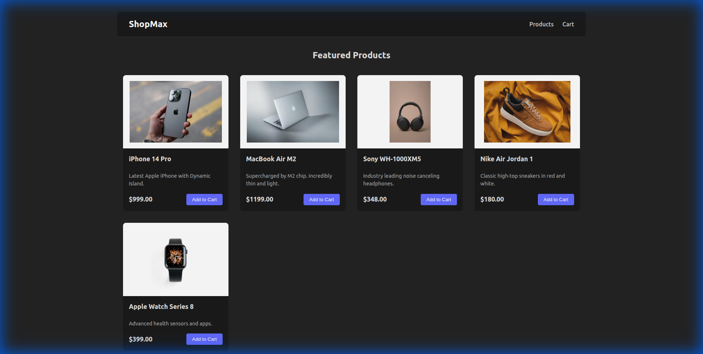
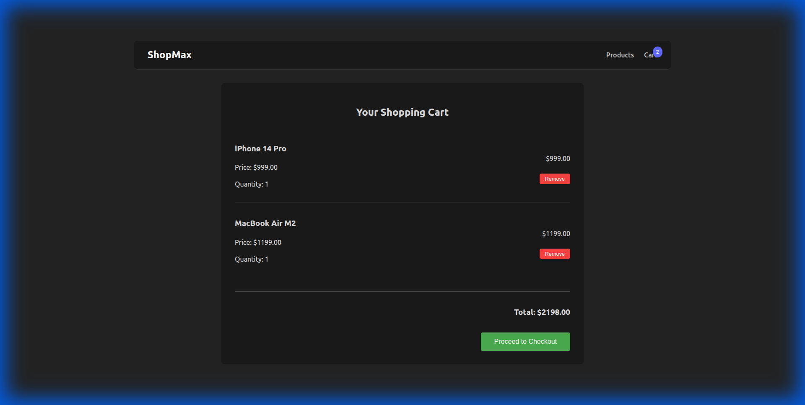

# Full-Stack Shopping App

A modern, full-stack shopping application built with **React (Vite)** on the frontend and **FastAPI (Python)** on the backend. This project demonstrates a clean architecture with a responsive UI and RESTful API integration.

## Features

- **Product Listing**: View a list of featured products fetched dynamically from the backend.
- **Shopping Cart**: Add items to your cart, view the cart summary, and remove items.
- **Real-time Updates**: The cart badge updates instantly as you add or remove items.
- **Responsive Design**: Optimized for different screen sizes.

## tech Stack

- **Frontend**: React, Vite, React Router, CSS Modules
- **Backend**: FastAPI, Python, Pydantic
- **Database**: In-memory (Python list) for demonstration purposes

## Screenshots

### Home Page
The home page displays a grid of available products.


### Shopping Cart
The cart page shows your selected items and the total price.


## Getting Started

### Prerequisites

- Node.js (v18+)
- Python (v3.10+)

### Backend Setup

1.  Navigate to the backend directory:
    ```bash
    cd backend
    ```
2.  Create a virtual environment:
    ```bash
    python -m venv venv
    source venv/bin/activate  # On Windows: venv\Scripts\activate
    ```
3.  Install dependencies:
    ```bash
    pip install -r requirements.txt
    ```
4.  Run the server:
    ```bash
    uvicorn app.main:app --reload --host 0.0.0.0 --port 8000
    ```

### Frontend Setup

1.  Navigate to the frontend directory:
    ```bash
    cd frontend
    ```
2.  Install dependencies:
    ```bash
    npm install
    ```
3.  Run the development server:
    ```bash
    npm run dev
    ```
4.  Open your browser at `http://localhost:5173`.
